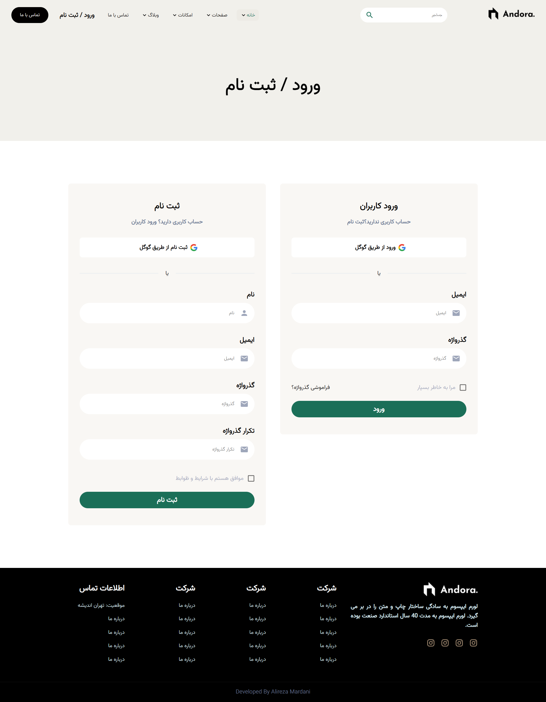
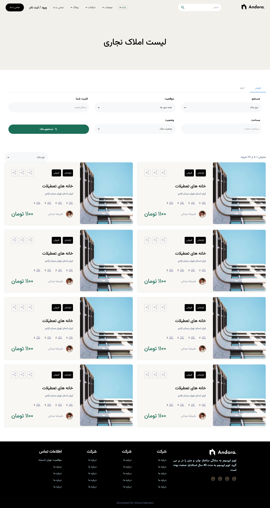
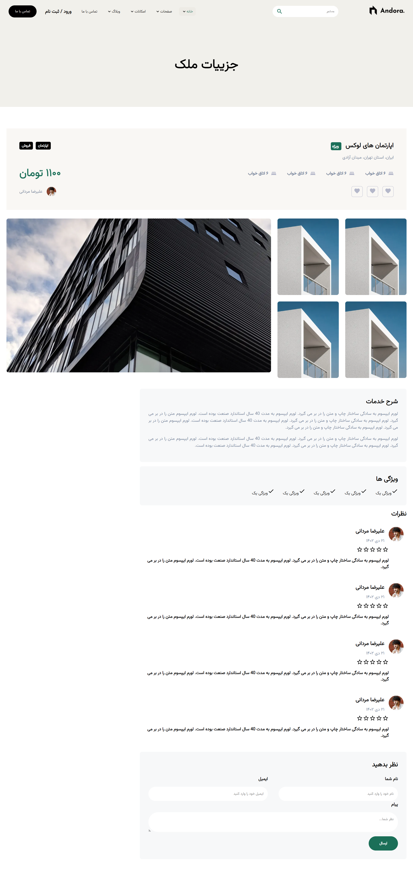

# Andora — Real Estate UI (Next.js)

Andora is a clean and minimal real estate frontend built with **Next.js**.  
It includes a landing page, a property listing page, and a property details page using **mock data**.

## Pages
- Home (Index)
- Properties Listing
- Property Details

## Features
- Property cards and details view
- Mock data-driven rendering
- Responsive layout
- Simple and clean UI

## Tech Stack
- Next.js (React)
- Tailwind CSS

## Getting Started
```bash
npm install
npm run dev
```

## Screenshots




